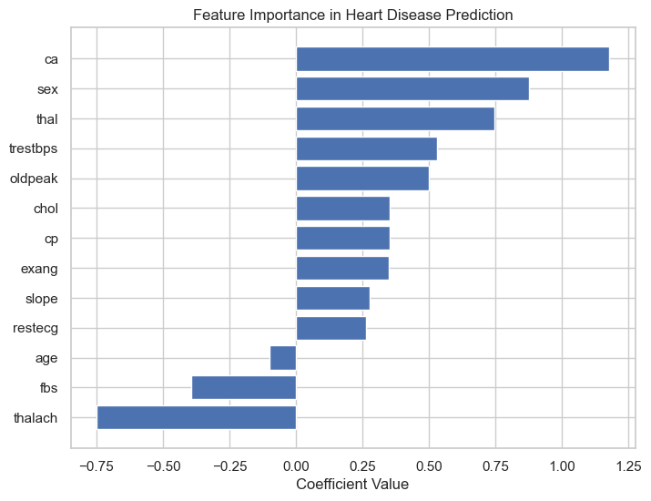
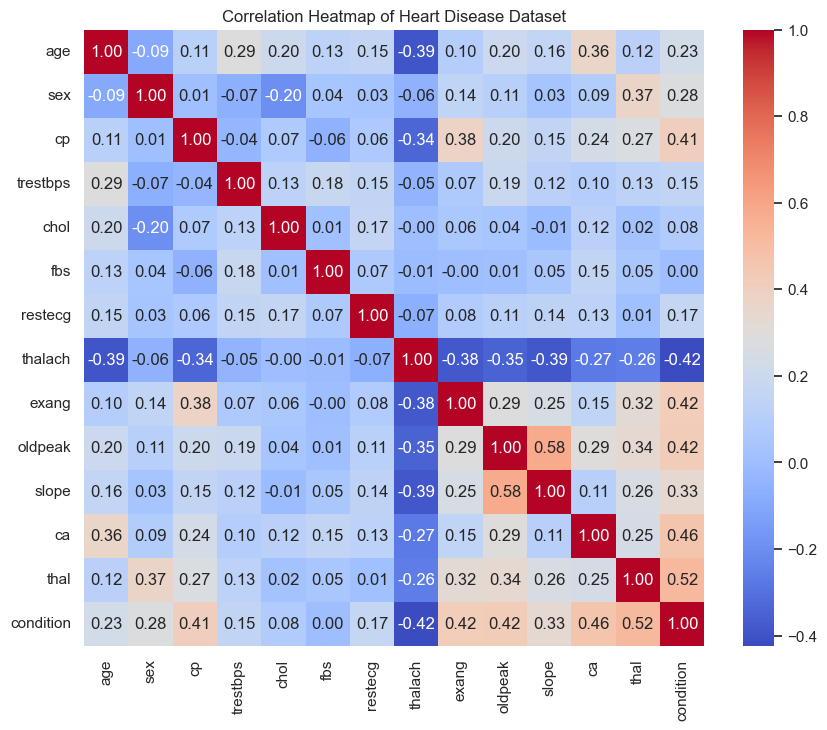

# Heart Disease Prediction using Machine Learning  

  
  
  

---

## Overview  

This project predicts the likelihood of heart disease using machine learning techniques.  
It explores relationships between medical attributes such as cholesterol, blood pressure, and heart rate,  
then trains a Logistic Regression model to predict whether a patient is likely to have a heart condition.  

The goal is to demonstrate the full **data science workflow**:
- Data loading and exploration  
- Correlation analysis and visualization  
- Feature preprocessing and model training  
- Model evaluation and feature importance insights  

---

## Dataset  

The dataset used in this project includes attributes such as:
| Feature | Description |
|----------|-------------|
| `age` | Age of the patient |
| `sex` | Gender (1 = male, 0 = female) |
| `cp` | Chest pain type |
| `trestbps` | Resting blood pressure |
| `chol` | Serum cholesterol (mg/dl) |
| `fbs` | Fasting blood sugar > 120 mg/dl (1 = true, 0 = false) |
| `restecg` | Resting electrocardiographic results |
| `thalach` | Maximum heart rate achieved |
| `exang` | Exercise-induced angina (1 = yes, 0 = no) |
| `oldpeak` | ST depression induced by exercise relative to rest |
| `slope` | Slope of the peak exercise ST segment |
| `ca` | Number of major vessels (0–3) colored by fluoroscopy |
| `thal` | Thalassemia (3 = normal, 6 = fixed defect, 7 = reversible defect) |
| `condition` | Target variable (1 = heart disease, 0 = healthy) |

---

## Model Performance  

| Metric | Score |
|--------|--------|
| **Accuracy** | **73.45%** |
| **Model Used** | Logistic Regression |

While Logistic Regression provides a strong baseline, the model can be improved using ensemble methods like **Random Forest**, **XGBoost**, or **Gradient Boosting**.

---

### 🔍 Feature Importance Insights

The chart below visualizes how each medical feature influences the prediction of heart disease in our Logistic Regression model.

- **Positive coefficients** (bars to the right) increase the likelihood of heart disease.  
- **Negative coefficients** (bars to the left) indicate features that reduce the risk (protective factors).

#### 🩺 Key Findings:
- **`ca` (number of major vessels)** is the strongest predictor — more blocked vessels significantly increase heart disease risk.  
- **`sex` and `thal`** are also strong positive contributors, meaning males and certain thalassemia conditions are associated with higher risk.  
- **`trestbps` (resting blood pressure)** and **`oldpeak` (exercise-induced ST depression)** moderately raise the likelihood of heart issues.  
- On the other hand, **`thalach` (maximum heart rate achieved)** shows a strong negative correlation, suggesting that higher exercise capacity is linked with better heart health.

Overall, the model identifies vessel condition, blood pressure, and exercise response as key risk indicators.

## 🧩 Correlation Heatmap  

A correlation heatmap is used to visualize relationships between variables:  
- 🔴 **Reds** → strong positive correlation (as one increases, so does the other)  
- 🔵 **Blues** → strong negative correlation (as one increases, the other decreases)  
- ⚪ **Whites or pale colors** → weak or no correlation  

This helps identify which features have the most impact on heart disease likelihood.

---

## 🛠️ Installation & Setup  

### 1. Clone the repository
git clone https://github.com/yourusername/heart-disease-prediction.git
cd heart-disease-prediction

###2. Create python Environment
python -m venv venv
source venv/bin/activate   # For macOS/Linux
venv\Scripts\activate      # For Windows

###3. Install dependencies
pip install -r requirements.txt

Run the notebook
Open heart_disease_prediction.ipynb in Jupyter Notebook or VS Code and run all cells.

Results Summary

-The dataset was analyzed and visualized to uncover relationships among key medical features.

-The Logistic Regression model achieved an accuracy of 73.45%, indicating strong predictive potential.

-Correlation analysis revealed that variables like oldpeak, thalach, and ca are key indicators.

-The project demonstrates a clear end-to-end data analysis → visualization → modeling workflow.

 ### Future Improvements

-Try advanced models (Random Forest, XGBoost, SVM)

-Perform hyperparameter tuning using GridSearchCV

-Add ROC curves and AUC scores for better performance evaluation

### Author

Nancy Gikandi
📍 Geomatic Engineer| GIS analyst lover| Data Enthusiast | Aspiring Data Scientist

